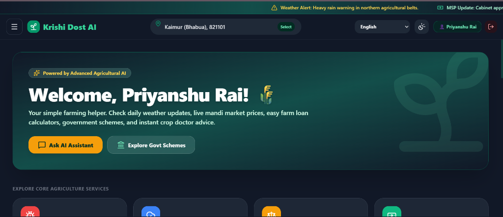
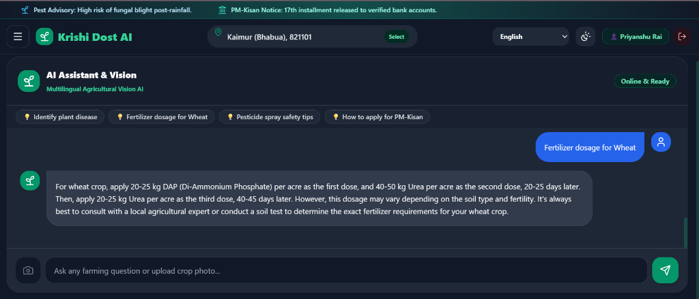
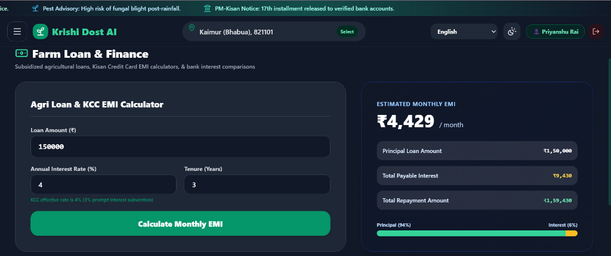
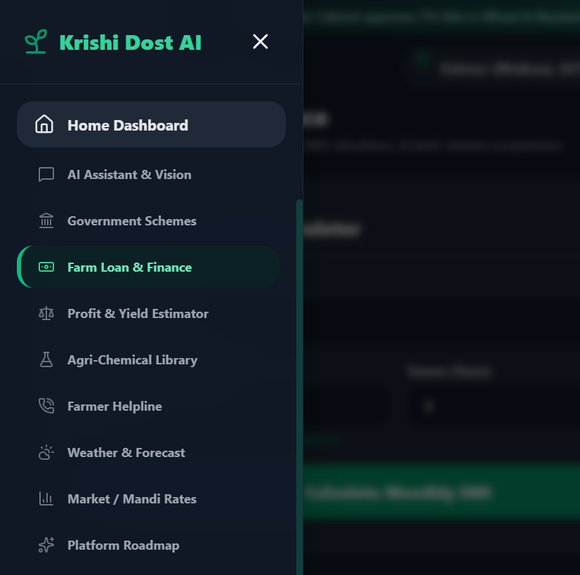

# 🌾 Krishi Dost AI (कृषि दोस्त AI)
> **Empowering 140+ Million Indian Farmers with Next-Gen Artificial Intelligence**

[](https://krishi-dost-ai.vercel.app/)

[](https://vitejs.dev/)
[](https://nodejs.org/)
[](https://groq.com/)
[](LICENSE)

🌐 **Official Live Web Application**: [https://krishi-dost-ai.vercel.app/](https://krishi-dost-ai.vercel.app/)

**Krishi Dost AI** is an all-in-one digital agriculture platform designed specifically for Indian farmers. It combines real-time meteorological advisories, live Mandi commodity prices, AI-driven crop leaf disease diagnosis, subsidized Kisan Credit Card (KCC) loan calculators, and government agricultural scheme portals into a clean, modern web application.

---

## 🔗 Live Links & Quick Access

- **🌐 Live Production Website**: [https://krishi-dost-ai.vercel.app/](https://krishi-dost-ai.vercel.app/)
- **💻 GitHub Source Repository**: [https://github.com/priyanshurai10/Krishi-Dost-Ai](https://github.com/priyanshurai10/Krishi-Dost-Ai)
- **⚡ Backend Service API**: [https://krishi-dost-backend.onrender.com](https://krishi-dost-backend.onrender.com)

---

## 📸 Screen Showcase & Module Explanations

### 1. 🏡 Home Dashboard View


#### 🔍 Explanation & Features:
- **Personalized Farmer Greeting**: Displays `"Welcome, Priyanshu Rai! 🌾"` with simple, jargon-free explanations designed for farmers.
- **Header Notice Ticker**: Live marquee scrolling alerts for weather warnings (heavy rain risks) and government MSP policy updates.
- **Interactive Location Selector**: Header Pincode button allowing direct 6-digit Pincode input or State/District selection across all **36 Indian States and Union Territories**.
- **Quick Action Triggers**: Instant navigation buttons to **Ask AI Assistant** and **Explore Govt Schemes**.
- **Core Services Grid**: Intuitive grid cards for Disease Identification, Weather Forecast, Profit Estimator, and Loan Center.

---

### 2. 🤖 AI Assistant & Crop Health Vision


#### 🔍 Explanation & Features:
- **Strict Language-Matched Responses**: Powered by Groq `llama-3.3-70b-versatile`. Automatically detects the user's prompt language/script (Hindi, Hinglish, English, Bengali, Marathi, Punjabi, Tamil, Telugu, etc.) and **replies strictly in that exact same language**.
- **Multilingual Crop Doctor**: Provides step-by-step fertilizer dosage, pesticide spray timing, and crop disease diagnosis.
- **Photo Diagnosis Upload**: Allows farmers to snap or upload leaf pictures to detect fungal blight or rust warnings.
- **Dynamic Full-Screen Layout**: Fills 100% of the viewport height (`h-[calc(100vh-7.5rem)]`) for a comfortable, distraction-free chat experience.

---

### 3. 💳 Farm Loan & Finance Calculator


#### 🔍 Explanation & Features:
- **Kisan Credit Card (KCC) EMI Engine**: Calculates monthly payments under the government subsidized **4% interest rate** (incorporating prompt 3% interest subvention).
- **Instant Result Breakdown**: Displays **Monthly EMI** (e.g. `₹4,429 / month` for `₹1,50,000` principal over `3 years`), Total Payable Interest (`₹9,430`), and Total Repayment (`₹1,59,430`).
- **Visual Principal vs. Interest Progress Bar**: Interactive visual bar indicating **Principal (94%) vs Interest (6%)** distribution.

---

### 4. 📱 Collapsible Drawer Navigation Menu


#### 🔍 Explanation & Features:
- **On-Demand Menu Bar**: Side drawer remains hidden by default to maximize screen space. Opens smoothly upon clicking the top header **Menu** button.
- **Auto-Disappear Navigation**: Selecting any navigation item automatically closes the drawer menu and transitions to the selected page.
- **Complete Module Coverage**: Quick access to Home Dashboard, AI Vision, Govt Schemes, Farm Loans, Profit Estimator, Agri-Chemical Library, Farmer Helplines, Weather Forecasts, Mandi Rates, and Upcoming Roadmap.

---

## 🛠️ Technology Stack

- **Frontend Framework**: React 18 + Vite 8
- **Styling**: Tailwind CSS + Custom CSS Glassmorphic Tokens
- **Icons**: Lucide Icons + Brand SVGs
- **Backend Runtime**: Node.js + Express.js
- **AI Infrastructure**: Groq Cloud Open-AI Compatible API (`llama-3.3-70b-versatile`)
- **Weather & Geo Engine**: Open-Meteo Weather Forecast API + All-India Pincode Dataset

---

## 🚀 Quick Setup & Installation Guide

### Prerequisites
- Node.js (v18 or higher)
- npm or yarn

### 1. Clone Repository
```bash
git clone https://github.com/priyanshurai10/Krishi-Dost-Ai.git
cd Krishi-Dost-Ai
```

### 2. Backend Setup
```bash
cd backend
npm install
```
Create a `.env` file inside `backend/`:
```env
PORT=5000
GROQ_API_KEY=your_groq_api_key_here
```
Start backend server:
```bash
node server.js
```

### 3. Frontend Setup
```bash
cd ../frontend
npm install
npm run dev
```
Open **`http://localhost:5173/`** or visit the live app at **`https://krishi-dost-ai.vercel.app/`**.

---

## 👨‍💻 Developer & Author Profile

Designed & Developed by **Priyanshu Rai**:

- **🌐 Live Production Website**: [krishi-dost-ai.vercel.app](https://krishi-dost-ai.vercel.app/)
- **💻 GitHub Source Repository**: [github.com/priyanshurai10/Krishi-Dost-Ai](https://github.com/priyanshurai10/Krishi-Dost-Ai)
- **🐙 GitHub Profile**: [github.com/priyanshurai10](https://github.com/priyanshurai10)
- **💼 LinkedIn Profile**: [linkedin.com/in/priyanshu-rai-2114722ab](https://linkedin.com/in/priyanshu-rai-2114722ab)
- **🚀 Personal Portfolio**: [priyanshurai-portfolio.vercel.app](https://priyanshurai-portfolio.vercel.app/)

---

## 📜 License
This project is licensed under the MIT License - see the [LICENSE](LICENSE) file for details.
